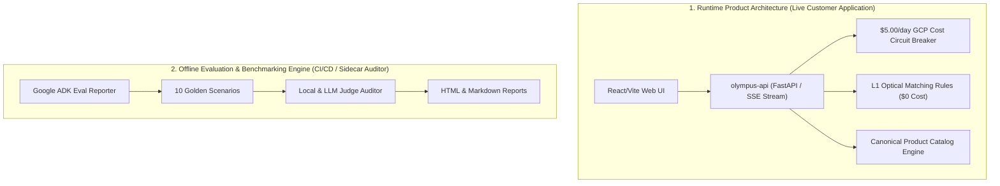

# `.agents/` — Teamwork Swarm Protocol & Best Practices

> **Project:** `olympus-product-specialist`  
> **Governance:** DeNovo Synthesis & Teamwork Swarm Protocol  
> **First Written:** 2026-08-06  

---

## 1. Prime Directives

1. **Documentation Law:** Every interface change ships its documentation in the same commit. A PR or task without doc updates is incomplete.
2. **Docs are Shared Memory:** Agent memory does not travel across sessions. Anything not recorded in `.agents/` is forgotten.
3. **Honest State, Always:** Score and report what is true. Never fabricate data, never hardcode passing mock results, never let a fallback look like real success.
4. **Visibly Degraded, Never Silently Passing:** Render explicit empty/error states on failures rather than inventing content.
5. **Strict Runtime vs Evaluation Separation:** Runtime Product Architecture (`olympus-api`, `catalog.py`, `rules.py`) serves live customer queries. The Judge (`local_judge.py`) exists strictly in the offline Evaluation & CI/CD Benchmarking Engine.

---

## 2. Architecture Boundary Specification



| Layer | Component Scope | Responsibility |
|---|---|---|
| **Runtime Product Architecture** | `olympus-api`, `catalog.py`, `rules.py`, `cost_gate.py` | Live customer response generation, optical validation, catalog lookup, and SSE streaming with zero Judge latency overhead. |
| **Offline Evaluation Engine** | `evals/graders/local_judge.py`, `eval_reporter.py` | Offline benchmark auditing, scenario scoring, quality reporting, and CI/CD validation. |

---

## 3. Role Pipeline & Verdicts

```
Sentinel ─► Orchestrator ─► Explorers ─► Workers
                                              │
                                              ▼
                                Reviewers + Challengers
                                              │
                                              ▼
                                     Forensic Auditor
                                      │            │
                               CLEAN  │            │ INTEGRITY VIOLATION
                                      ▼            ▼
                             Victory Auditor    Remediation Loop
```

| Role | Allowed Verdicts | Purpose |
|---|---|---|
| **Reviewer / Challenger** | `APPROVE` · `REQUEST_CHANGES` | Static & empirical review |
| **Forensic Auditor** | `CLEAN` · `INTEGRITY VIOLATION` | Systemic integrity & rule validation |
| **Victory Auditor** | `VICTORY CONFIRMED` · `VICTORY REJECTED` | Zero-shared-context final verification |

---

## 4. Directory & File Contract

| File | Written By | Read By | Purpose |
|---|---|---|---|
| `ORIGINAL_REQUEST.md` | Parent / User | Agents, Auditors | Immutable ledger of user requests |
| `BRIEFING.md` | Agent | Successors, Auditors | Identity, constraints, artifact index |
| `progress.md` | Agent | Sentinel, Orchestrator | Liveness heartbeat & milestone checklist |
| `plan.md` | Orchestrator | Swarm Agents | Phase decomposition & dispatch matrix |
| `handoff.md` | Agent | Parent, Successors | 5-section inter-agent contract |
| `TEAMWORK_ASSETS_INDEX.md` | Orchestrator | Swarm Agents | Asset & tool capabilities registry |

---

## 5. Canonical 5-Section Handoff Format

Every `handoff.md` file must strictly contain:
1. `## 1. Observation`
2. `## 2. Logic Chain`
3. `## 3. Caveats`
4. `## 4. Conclusion`
5. `## 5. Verification Method` (Copy-pasteable execution commands)
