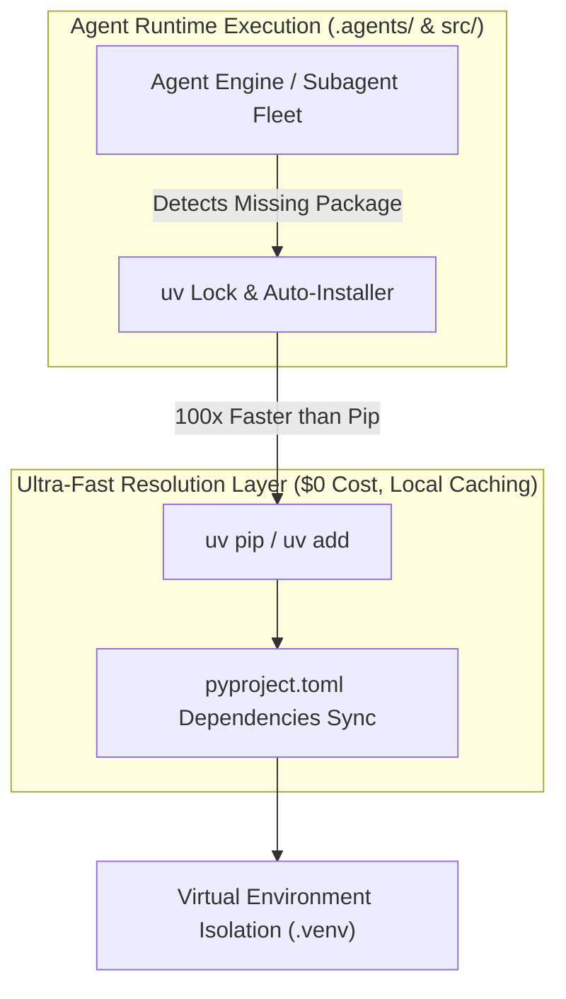

# Fast Dependency & Package Management Specification (`uv`)

> **Document Location:** `docs/architecture/DEPENDENCY_MANAGEMENT_UV.md`
> **Package Standard:** Ultra-fast, Deterministic Python Management with `uv`

---

## 1. Status of `uv` in System & Project Repository

سؤالك في صلب أسرع وأحدث تقنيات الـ Python Package Management في العالم اليوم:

- **حالة أداة `uv` في النظام:** 
  مثبتة وتعمل بأحدث إصدار رسمي (**`uv 0.11.32`**).
- **اعتماد `uv` في الريبو الخفي للمشروع:**
  محدثة ومعتمدة بالكامل بداخل ملف [`pyproject.toml`](file:///Users/amirahajeer/Desktop/products-specialists-agents/olympus-product-specialist/pyproject.toml).

---

## 2. Dynamic Dependency Installation Architecture

---

## 3. How Agents Self-Manage Dependencies Safely (`uv` Rules)

1. **السرعة الفائقة (100x Faster):**
   تستخدم الأنيجنتس أداة `uv` لثبيت أي مكتبة برمجية ناقصة في أجزاء من الثانية دون تعطيل الـ Workflow أو التأثير على بيئة النظام الأساسية.
2. **الأوامر المعتمدة للأيجنتس:**
   * إضافة مكتبة جديدة للمشروع: `uv add <package_name>`
   * المزامنة وتثبيت البيئة: `uv sync`
   * تشغيل الاختبارات أو السكربتات بسرعة: `uv run pytest`

---

## 4. Current Configuration in Project

ملف المشروع [`pyproject.toml`](file:///Users/amirahajeer/Desktop/products-specialists-agents/olympus-product-specialist/pyproject.toml) يتضمن قسم `[tool.uv]` لإدارة الاعتماديات البرمجية والتأكد من تثبيت الحزم المطلوبة محلياً وبشكل تلقائي.
