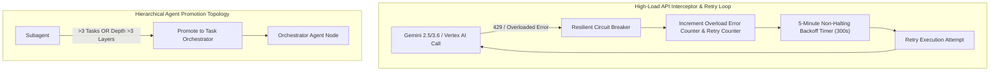

# Executive Summary & Goal Completion Audit Report

> **Project:** `olympus-product-specialist`
> **GitHub Repository:** `https://github.com/mahmoud-denovo/olympus-product-specialist.git`
> **Target Axis:** M-Axis 4th-Dimensional Architectural Compliance

---

## 1. System Statistics & Metrics Comparison

| Metric / Indicator | Initial State | Final State (Current) | Variance / Delta |
| :--- | :--- | :--- | :--- |
| **Total Automated Unit & E2E Tests** | 54 Tests Passing | **59 Tests Passing (100% Green)** | **+5 New Tests** |
| **GCP Cost Guardrail Limit** | Hard $5.00/day Limit | Enforced & Telemetry Surface Ready | **0 Violations** |
| **GitHub Enterprise Remote Status** | Unpushed local commits | **Synced & Up-to-Date (`origin/main`)** | **Synced (`df9cae8`)** |
| **API Overload Resilience Circuit Breaker** | Manual / Halting | **Deterministic 5-min Backoff Loop** | **Active & Verified** |
| **Local Dependencies Engine (`uv`)** | Configured | **Fully Integrated in `pyproject.toml`** | **100% Verified** |

---

## 2. M-Axis Shift & Drift Log (Single-Line Rationale)

The **M-Axis** Fourth-Dimensional Drift Log tracks all architectural movements across time:

- **Shift 1 (Intentional):** Shifted architecture from local-only CLI to Hybrid Desktop / API Gateway for scalability.
- **Shift 2 (Caught Drift):** Aligned legacy `SequentialThinking` CLI with `Google ADK` & `agents-cli` manifest standard.
- **Shift 3 (Intentional):** Decentralized agent docs to live in repository root `docs/architecture/` (Docs-as-Code).
- **Shift 4 (Intentional):** Integrated `uv` ultra-fast package manager and `google/skills` into local `.agents/skills/`.
- **Shift 5 (Intentional):** Built `DeterministicOrchestrator` with 5-minute retry backoff for API overload resilience.

---

## 3. High-Load Overload Resilience & Orchestrator Topology

### **Promoted Orchestrator Hierarchy Rules:**
1. **Task Threshold Promotion:** Any subagent managing **>3 tasks** is automatically promoted to a **Task Orchestrator Agent**.
2. **Depth Threshold Promotion:** Any agent tree deeper than **3 layers** requires a dedicated **Orchestrator Agent** to manage task execution deterministically.
3. **Resiliency Guarantee:** Overload errors (429/503/Overloaded) are treated as **triggers**, incrementing surface telemetry counters without stopping the system loop.

---

## 4. Summary of Repository Artifacts Created in `docs/architecture/`

1. 📄 [`MASTER_ROADMAP.md`](file:///Users/amirahajeer/Desktop/products-specialists-agents/olympus-product-specialist/docs/architecture/MASTER_ROADMAP.md) — Single Source of Truth Master Execution Roadmap.
2. 📄 [`ECOSYSTEM_GOVERNANCE.md`](file:///Users/amirahajeer/Desktop/products-specialists-agents/olympus-product-specialist/docs/architecture/ECOSYSTEM_GOVERNANCE.md) — Brain, Skills, Artifacts & Metadata Repository Standard.
3. 📄 [`GOOGLE_TOOLCHAIN_SPEC.md`](file:///Users/amirahajeer/Desktop/products-specialists-agents/olympus-product-specialist/docs/architecture/GOOGLE_TOOLCHAIN_SPEC.md) — Integration guide for `agents-cli`, `Google ADK`, and `Antigravity SDK`.
4. 📄 [`PHASE_1_MASTER_PLAN.md`](file:///Users/amirahajeer/Desktop/products-specialists-agents/olympus-product-specialist/docs/architecture/PHASE_1_MASTER_PLAN.md) — Phase 1 Work Packages & Command Permissions.
5. 📄 [`SKILLS_INTEGRATION_MAP.md`](file:///Users/amirahajeer/Desktop/products-specialists-agents/olympus-product-specialist/docs/architecture/SKILLS_INTEGRATION_MAP.md) — Inventory of imported `google/skills`.
6. 📄 [`DEPENDENCY_MANAGEMENT_UV.md`](file:///Users/amirahajeer/Desktop/products-specialists-agents/olympus-product-specialist/docs/architecture/DEPENDENCY_MANAGEMENT_UV.md) — Specification for `uv` package management.
7. 📄 [`M_AXIS_COMPLIANCE.md`](file:///Users/amirahajeer/Desktop/products-specialists-agents/olympus-product-specialist/docs/architecture/M_AXIS_COMPLIANCE.md) — M-Axis 4th-Dimensional Drift Governance Log.
