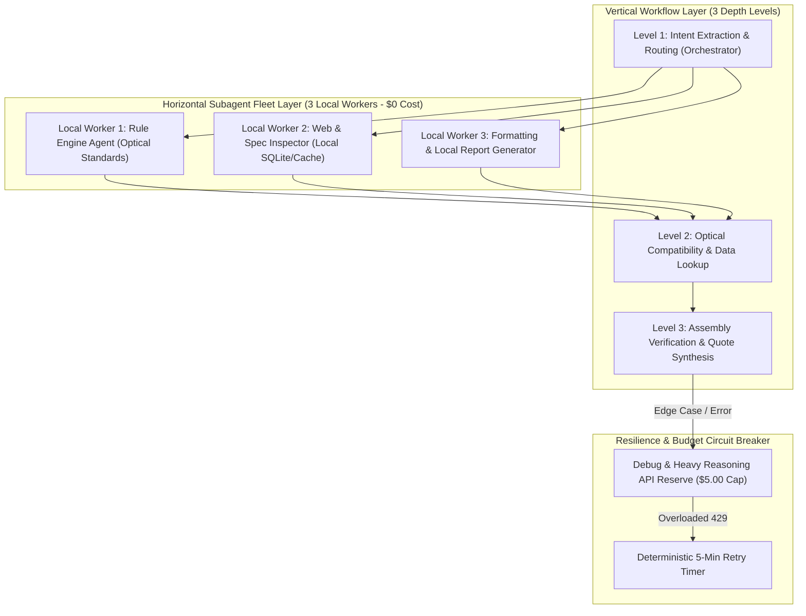

# Local-First Hybrid Agent Topology & Budget Allocation Plan

> **Document Location:** `docs/architecture/HYBRID_AGENT_TOPOLOGY.md`
> **Strategy:** Maximize Local Zero-Cost Work execution using 3 Local Subagents + Reserve LLM API Budget strictly for Complex Synthesis, High-Dimension Routing & Debugging.

---

## 1. Context & Rationale

To prevent LLM API overload (e.g., GitHub / Vertex 429 errors) and optimize budget consumption:
1. **Local Worker Subagents ($0 Cost):** Light/repetitive tasks (Deterministic optical rule checks, SQLite catalog lookups, spec validation, formatting) are delegated to **3 Local Subagents** running locally on the user's machine.
2. **API Budget Isolation:** Paid/Quota-restricted LLM calls are strictly reserved for:
   - Deep Multi-Dimensional Synthesis (Horizontal & Vertical 3D Workflows).
   - Autonomous Self-Healing & Debugging when Local Rules flag an edge case.
   - Master Orchestration when agent task trees exceed 3 depth levels.

---

## 2. 3D Hybrid Execution Architecture (Horizontal x Vertical)

---

## 3. Dedicated Local Subagents Fleet Definition

| Local Subagent Name | Scope & Task Assignment | Resource Cost | Execution Mode |
| :--- | :--- | :--- | :--- |
| **`LocalOpticsWorker`** | Executes deterministic microscope stand & objective compatibility rules (`validate_stand_optics`). | **$0.00** | Python Local Rule Engine |
| **`LocalCatalogWorker`** | Executes fast local vector & hybrid search against local SQLite/JSON catalogs. | **$0.00** | SQLite / Local Search |
| **`LocalFormatterWorker`** | Formats bilingual responses, checks UI/Markdown syntax, updates local docs. | **$0.00** | Local Text Processing |

---

## 4. API Budget & Debug Allocation

- **Debugging & Self-Healing Budget:** 100% of LLM API Quota ($5.00/day limit) is dedicated to debugging, self-healing remediation, and high-dimensional multi-objective synthesis.
- **Overnight Execution Safety:** Local subagents can run indefinitely overnight. If an API call fails due to high load (429/Overloaded), the system safely logs the event, initiates a 5-minute backoff timer, and resumes work automatically without crashing.

---

## 5. Work Package & Action Items

1. **WP1:** Register 3 Local Worker Subagents in `agents-cli-manifest.yaml`.
2. **WP2:** Enforce local-first fallback in `EAERPipeline` stage 1 & 2 before making external LLM calls.
3. **WP3:** Test overnight loop resilience with local workers and 5-minute timer backoffs.
