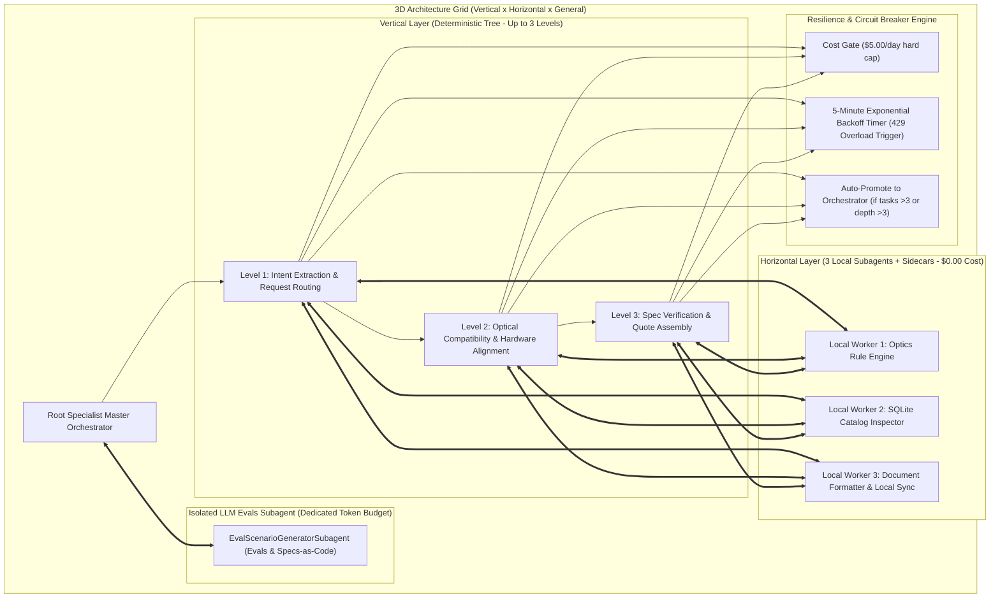

# Unified Master Plan & Architecture Specification: DeNovo Hybrid Agent Platform

> **Document Location:** `docs/architecture/MASTER_ARCHITECTURE_PLAN.md`
> **Target System:** `olympus-product-specialist`
> **DNA:** Local-First Hybrid Multi-Agent System (Vertical x Horizontal x General)

---

## 1. Executive Summary & Architecture Blueprint

This document defines the single, non-negotiable **Master Plan Architecture** for the DeNovo Olympus Product Specialist platform.

---

## 2. Core Architecture Rules & Constraints

1. **Local-First Priority ($0.00 Cost):**
   * Lightweight tasks (rules, catalog lookup, formatting, sidecars) run 100% locally on the user's host machine.
2. **LLM Budget Protection ($5.00/day Limit):**
   * Paid LLM tokens are strictly reserved for isolated evaluation generation (`EvalScenarioGeneratorSubagent`), deep synthesis, and autonomous debugging.
3. **Resiliency as a First-Class Trigger:**
   * High-load `429/503` API errors trigger a 5-minute backoff timer (300s). The agent never stops or crashes.
4. **Structural Promotion Rule:**
   * Any subagent managing **>3 tasks** or operating at a depth **>3 layers** is promoted to an **Orchestrator Agent**.
5. **Continuous M-Axis Compliance Log:**
   * Every architectural shift or drift is logged line-by-line with a single-sentence rationale in `docs/architecture/M_AXIS_COMPLIANCE.md`.
