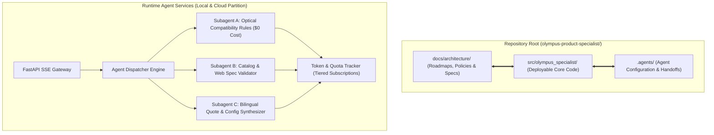
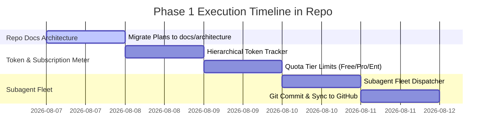

# DeNovo Olympus Product Specialist — Repository-Native Master Roadmap

> **Repository Location:** `docs/architecture/MASTER_ROADMAP.md`
> **Standard:** Enterprise Corporate Documentation Best Practice (Single Source of Truth)

---

## 1. Governance & Documentation Best Practice (حل مشكلة مكان التوثيق)

سؤالك في صلب المعايير العالمية لشركات الانتربرايز والـ Corporate Software Engineering:

### **كيف تُدار مستندات المعمارية والخطط في الشركات الكبرى (Enterprise Best Practices)؟**
1. **Single Source of Truth (المصدر الموحد):**
   * يجب أن تعيش جميع مخططات المعمارية (`Architecture Specs`)، الخطط التنفيذية (`Roadmaps & Master Plans`)، والسياسات (`Policies`) **داخل مستودع المشروع (Repository Root)** في مجلد رسمي موحد مثل `docs/architecture/`.
   * **السبب:** لتكون مرئية مباشرة لأي مهندس أو شريك يفتح محرر الأكواد (IDE)، وتكون خاضعة للـ Version Control عبر Git مع الأكواد بنفس الـ Commit History.
2. **مكان الـ Root Agent محلياً:**
   * الـ Root Agent يحفظ ملفاته التنفيذية الحية (`.agents/` و `docs/`) داخل الريبو الخاص بالمنتج، بينما يستخدم مجلد النظام الخارجي مجرد كاش مؤقت (Scratch/Cache).
   * بهذا يضمن الشريك والمستثمر والمطور أن كل شيء يخص المشروع موجود في مجلد المشروع نفسه.

---

## 2. Dynamic Enterprise Architecture & Subagent Topology

---

## 3. Immediate Implementation Steps (الملفات الناتجة في الريبو)

من الآن فصاعداً، جميع الخطط والـ Architecture Blueprint والوثائق تُحفظ وتُحدّث بانتظام في هذا المسار الرئسي داخل مشروعك:

* 📄 **الخطة الشاملة الرئيسية:** `docs/architecture/MASTER_ROADMAP.md`
* 📄 **تقرير المعمارية والـ SDK:** `master_architecture_and_sdk_report.md`
* 📄 **سجل حوكمة السياسات والـ M-Axis:** `docs/architecture/M_AXIS_COMPLIANCE.md`

---

## 4. Phase 1 Goal Execution Workflow

