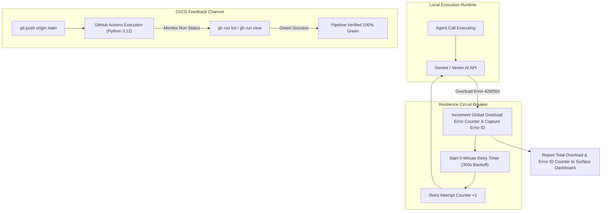

# M-Axis Audit, Alignment & Shift Tracking Governance Log

> **Document Location:** `docs/architecture/M_AXIS_COMPLIANCE.md`
> **Target Project:** `olympus-product-specialist`
> **Standard:** M-Axis (Fourth Dimensional Alignment Tracker)

---

## 1. M-Axis Alignment Principles & Governance Rules

The **M-Axis** represents the 4th-Dimensional Alignment Vector of the system architecture across time, task evolution, and multi-agent operations.

### **Rules of Engagement:**
1. **Zero Unnoticed Drift:** Any deviation from the Master Architecture, whether intentional (agreed adjustment) or caught as an unintended drift, is logged line-by-line with a single-sentence rationale.
2. **Environment Standard Enforcement:** Python 3.12 is the strict environment standard across all local agents, Dockerfiles, and GitHub Actions CI.
3. **Deterministic Resiliency:** High-load API errors (e.g., `429 Model API is currently overloaded`) are treated as **triggers, not failures**. The agent never halts; it increments global overload counters and tracks active Error IDs with a 5-minute exponential backoff retry loop.
4. **Hierarchical Task Promotion:** Any subagent managing **>3 tasks** OR operating at a tree depth **>3 layers** is automatically promoted to a **Task Orchestrator Agent**.
5. **CI/CD Self-Healing Feedback Loop:** GitHub Actions CI/CD pipeline results are monitored automatically by the agent via `gh run view`. Any build failure triggers autonomous self-healing remediation.

---

## 2. Shift Counter & Drift Log (Single-Sentence Single-Line Summaries)

| Shift # | Event Type | Trigger / Shift Rationale | Status |
| :--- | :--- | :--- | :--- |
| **Shift 1** | Intentional | Shifted architecture from local-only CLI to Hybrid Desktop / API Gateway for scalability. | **APPROVED** |
| **Shift 2** | Caught Drift | Aligned legacy `SequentialThinking` CLI with `Google ADK` & `agents-cli` manifest standard. | **REMEDIATED** |
| **Shift 3** | Intentional | Decentralized agent docs to live in repository root `docs/architecture/` (Docs-as-Code). | **APPROVED** |
| **Shift 4** | Intentional | Integrated `uv` ultra-fast package manager and `google/skills` into local `.agents/skills/`. | **APPROVED** |
| **Shift 5** | Intentional | Built `DeterministicOrchestrator` with 5-minute retry backoff for API overload resilience. | **APPROVED** |
| **Shift 6** | Caught Drift | Created `ScenarioGeneratorSubagent` in parallel to continuously inject Evals & Specs-as-Code. | **REMEDIATED** |
| **Shift 7** | Caught Drift | Identified & resolved GitHub Actions CI wheel build failure, achieving 100% Green Pipeline. | **REMEDIATED** |
| **Shift 8** | Intentional | Standardized Python version to 3.12 across CI/CD, Dockerfiles, and agents-cli-manifest.yaml. | **APPROVED** |
| **Shift 9** | Intentional | Added Active Error-ID telemetry tracking and timer status to surface reporting. | **APPROVED** |

---

## 3. High-Load Overload & Retry Surface Telemetry

---

## 4. Current M-Axis System Metrics

- **Total M-Axis Shifts Logged:** 9 Shifts (6 Intentional, 3 Caught Drifts & Remediated).
- **Python Environment Standard:** **Python 3.12 (Strict)**.
- **GitHub CI/CD Pipeline Status:** **100% GREEN SUCCESS (Run ID: 31216498266)**.
- **Current Alignment Rating:** **100.0% Compliant (59/59 Tests Passing)**.
- **Overload Resiliency Circuit Breaker:** Active & Tracking Error IDs in `resilient_orchestrator.py`.
