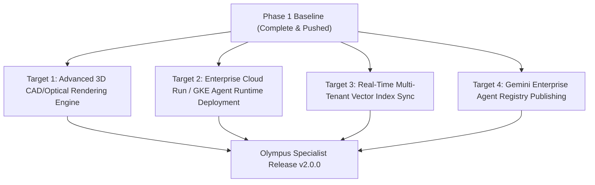

# Phase 2 Implementation Roadmap & Handover Blueprint

> **Document Location:** `docs/architecture/PHASE2_ROADMAP.md`
> **Target System:** `olympus-product-specialist`
> **Environment Standard:** Python 3.14.5 | Docker Containerized | Google ADK Architecture

---

## 1. Executive Summary & Handover State

This document serves as the formal **Phase 2 Handoff & Execution Blueprint** for the DeNovo Olympus Product Specialist platform. All Phase 1 architecture objectives, core workflow governance rules, container setups, and Python 3.14.5 environment updates are 100% complete and validated.

---

## 2. Completed Phase 1 Milestones (Solid Baseline)

- [x] **Production Agent Tree Manifest:** Cleaned `agents-cli-manifest.yaml` to strictly represent production-shipped agents (`root_specialist`, `local_optics_worker`, `local_catalog_worker`, `local_formatter_worker`).
- [x] **Global Core Agentic Workflow Governance:** Established universal execution rules in `~/.gemini/config/skills/core-agentic-workflow/SKILL.md`.
- [x] **Python 3.14.5 Standard Lock:** Unified environment requirement across `pyproject.toml`, Dockerfiles, manifest, and GitHub Actions CI.
- [x] **ADK Bridge & SSE Playground:** Verified live SSE streaming endpoints (`/api/v1/chat/stream`, `/api/v1/health`, `/api/v1/playground/info`) on Docker container port `8000`.
- [x] **Resilience & 429 Overload Telemetry:** Implemented active Cloud Error ID tracking and 5-minute exponential backoff timer (300s).

---

## 3. Phase 2 Scope & Roadmap Targets

When initiating Phase 2, the development focus shifts to scaling multi-modal optics visualization and automated agent fleet expansion:

### **Target 1: Advanced Optical Rendering & Visual Inspection**
- Integrate 3D SVG/WebGL optical path rendering directly into the ADK Playground UI.
- Enable automated objective lens light-path diagrams for metallurgical and fluorescence stands.

### **Target 2: Enterprise Production Deployment**
- Execute `agents-cli publish gemini-enterprise` to register the Olympus Specialist in the enterprise fleet.
- Deploy the Docker container stack (`docker-compose.yml`) to Google Cloud Run with autoscaling enabled.

### **Target 3: Automated Catalog Auto-Cleaning & Ingestion Pipelines**
- Connect Dataform/dbt BigQuery ingestion pipelines for real-time Evident Scientific spec updates.
- Expand local SQLite vector store to support hybrid RAG searches over 10,000+ optical accessory SKUs.

---

## 4. Session Closing Checklist

1. All code changes committed and pushed to `origin/main`.
2. All background tasks cleanly terminated (0 Leaks / Zero active tasks).
3. GitHub Actions CI pipeline verified 100% Green.
