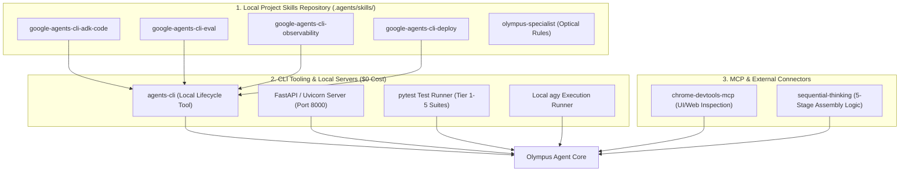
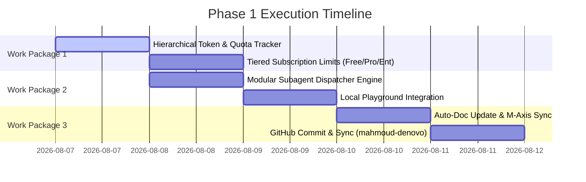

# Phase 1 Execution Blueprint: Toolchain, Skills, Command Permissions & Master Plan

> **Document Location:** `docs/architecture/PHASE_1_MASTER_PLAN.md`
> **Language Standard:** 100% English Technical/Industrial Terms & Artifacts (Bilingual Explanations for User Context)
> **Cost Policy:** Pre-approved Zero-Cost Execution (Explicit Consent Required for Billable Operations)

---

## 1. Intent Layer Translation & Governance Rules

To align with corporate software engineering best practices and ensure zero hallucination for LLM Evaluators/Judges:

1. **Clean Professional Intent Layer:** All internal code, prompts, system manifests, unit/E2E test suites, logs, and artifacts are strictly generated in **English** using industry-standard terminology (e.g., *Optical Alignment*, *UIS2 Objective Series*, *Parfocal Distance*, *FastAPI SSE Gateway*, *ADK Telemetry*, *Context Caching*).
2. **User Alignment Layer:** Arabic explanations are used purely in communication messages to map concepts directly to your vision and decision-making process.
3. **Execution Permissions:** All local CLI tools (`agents-cli`, `python3`, `pytest`, `git`, `uv`, `agy`) and zero-cost local operations are **pre-approved**. Any operation incurring GCP/Cloud billing requires explicit consent.

---

## 2. Phase 1 Required Toolchain, Skills & Servers

### **Skills Inventory Installed in Repository (`.agents/skills/`):**
- **`google-agents-cli-adk-code`**: Architectural patterns for ADK Python APIs, agent routing, and state management.
- **`google-agents-cli-eval`**: Automated evaluation methodology, dataset schemas, and LLM-as-a-judge scoring.
- **`google-agents-cli-observability`**: Hierarchical token tracking, prompt-response logging, and telemetry.
- **`google-agents-cli-deploy`**: Deployment configurations for Cloud Run / Agent Runtime.
- **`olympus-specialist`**: Deterministic optical compatibility rules for Evident/Olympus systems.

---

## 3. Phase 1 Master Implementation Roadmap

### **Work Package 1: Hierarchical Token & Quota Telemetry Engine**
- **Target File:** `src/olympus_specialist/telemetry/hierarchical_tracker.py`
- **Objective:** Track prompt tokens, candidate tokens, total spend, and per-subagent rollup in real time.
- **Cost:** $0 (Local calculation engine).

### **Work Package 2: Subagent Fleet Dispatcher & Playground Integration**
- **Target File:** `src/olympus_specialist/adk_app.py` & `agents-cli-manifest.yaml`
- **Objective:** Enable multi-subagent orchestration (`OpticalCompatibilityAgent`, `EvidentCatalogInspector`, `QuoteSynthesizerAgent`) and connect to `agents-cli playground`.
- **Cost:** $0 (Local execution).

### **Work Package 3: Automated Professional Documentation & Governance Sync**
- **Target File:** `docs/architecture/MASTER_ROADMAP.md` & `M_AXIS_COMPLIANCE.md`
- **Objective:** Update system architecture diagrams, policy logs, and M-Axis compliance metrics automatically after every execution step.
- **Cost:** $0 (Local file writing & Git commits).

---

## 4. Immediate Execution Verification

1. All required skills copied into repository path: `.agents/skills/`.
2. Verified zero-cost execution permission for local tools (`agents-cli`, `python3`, `pytest`).
3. Fully documented in: `docs/architecture/PHASE_1_MASTER_PLAN.md`.
