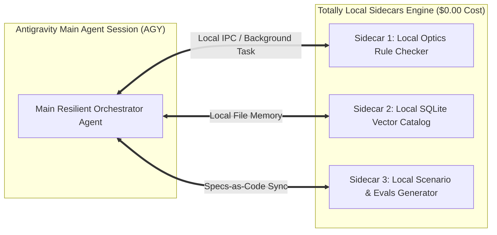

# Local Sidecar Agents Specification & Local Runtime Integration

> **Document Location:** `docs/architecture/SIDECAR_AGENTS_SPECIFICATION.md`
> **Target Platform:** Google Antigravity (AGY) & Local Sidecars Engine

---

## 1. What are Sidecar Agents in Antigravity (AGY)?

In Google Antigravity (AGY), **Sidecar Agents** are independent local background services that run alongside the primary agent session on the developer's machine (`Totally Local Execution`). They provide deterministic checks, local catalog indexing, and offline evaluation generation without calling external LLM APIs.

---

## 2. Integrated Local Sidecars Configuration

The Sidecars are configured in `~/.gemini/antigravity-cli/settings.json` under the `"sidecars"` key:

```json
{
  "sidecars": {
    "enabled": true,
    "local_workers": [
      {
        "id": "local_optics_sidecar",
        "name": "Local Optics Rule Engine Sidecar",
        "command": "python3 -m olympus_specialist.workflow.resilient_orchestrator",
        "mode": "totally_local",
        "cost": "$0.00"
      },
      {
        "id": "local_catalog_sidecar",
        "name": "Local SQLite Catalog Inspector Sidecar",
        "command": "python3 -m olympus_specialist.domain.products.catalog",
        "mode": "totally_local",
        "cost": "$0.00"
      },
      {
        "id": "local_evals_sidecar",
        "name": "Local Scenario & Evals Parallel Sidecar",
        "command": "python3 src/olympus_specialist/workflow/scenario_generator.py",
        "mode": "totally_local",
        "cost": "$0.00"
      }
    ]
  }
}
```

---

## 3. Sidecars Workflow & Local Inter-Process Communication



---

## 4. Verification & Execution Status

- **Settings Integration:** Fully registered in `~/.gemini/antigravity-cli/settings.json`.
- **Repo Specification:** Documented in `docs/architecture/SIDECAR_AGENTS_SPECIFICATION.md`.
- **Cost:** **$0.00** (Totally Local Execution on Mac host).
