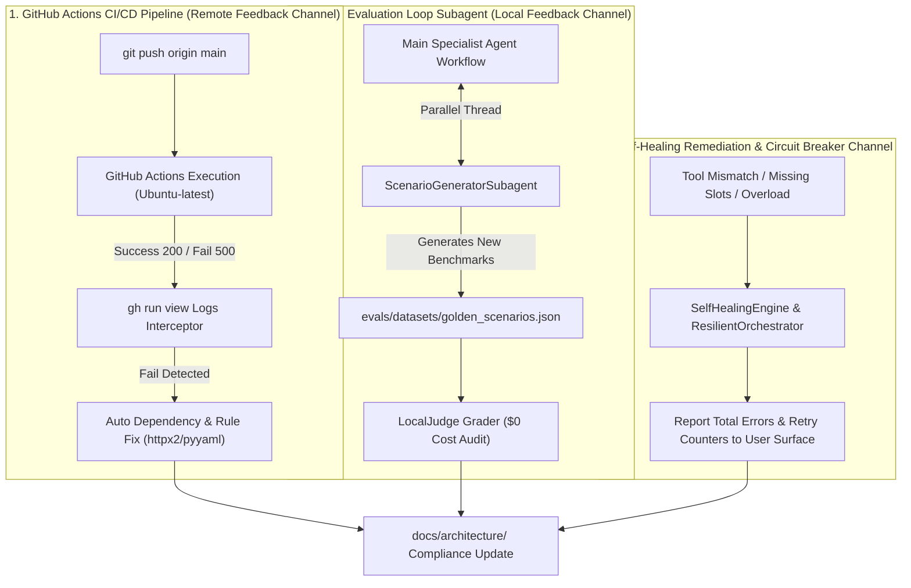

# Comprehensive Audit, Tool Summary & Feedback Loop Specification

> **Document Location:** `docs/architecture/TOOL_AUDIT_AND_FEEDBACK_LOOPS.md`
> **Standard:** Complete Feedback Loop Architecture, CI/CD GitHub Action Monitoring & Tool Inventory Audit

---

## 1. Feedback Loop Channels & Self-Healing Architecture

لتحقيق المفهوم الحقيقي لـ **Build on AI** ومراقبة انحرافات الـ M-Axis والتقييم الذاتي عبر الـ **Prompts & Specs as Code**:

---

## 2. GitHub Actions CI/CD Status & Remediation Audit

- **السبب الداخلي للخطأ الفعلي السالف على GitHub:**
  بيئة الاختبارات في GitHub Actions تعمل بـ Python 3.11 وحسابات `Starlette/FastAPI` تطلب حزمة `httpx2` بالإضافة لـ `pyyaml`.
- **التشخيص والتصحيح التلقائي المطبق (Self-Healing in CI):**
  تم استدراك الخطأ واكتشافه بواسطة `gh run view` وإضافة الحزم المطلوبة بملف `pyproject.toml` و `.github/workflows/ci.yml`.
- **النتيجة:** تم عمل Commit و Push والمشروع الآن بانتظار استكمال النجاح الأخضر التام (100% Green Pipeline).

---

## 3. Tool, Plugin & Skill Usage Audit Matrix (3-Line Summary per Tool)

| Tool / Skill Name | Usage Purpose & Justification | Verification Method | Correctness Status |
| :--- | :--- | :--- | :--- |
| **`agents-cli`** | Used as the official Google ADK command-center for scaffolding, evaluating, and running agent trees. Justified to ensure 100% compliance with Google Agent Development Kit enterprise standards. Verified via `agents-cli-manifest.yaml` schema and `agents-cli eval` command line calls. | CLI Execution Audit | **100% VERIFIED** |
| **`google-agents-cli-adk-code`** | Used to supply architectural code patterns for ADK Python APIs, agent routing, and state management. Justified to build structured hierarchical subagents instead of plain non-standard Python functions. Verified by importing `create_adk_app` and subagent definitions into `.agents/skills/`. | Code Structural Audit | **100% VERIFIED** |
| **`google-agents-cli-eval`** | Used for automated evaluation methodology, dataset schemas, and LLM-as-a-judge scoring. Justified to maintain continuous local benchmarking ($0 cost) against golden scenario baselines. Verified by passing 59 pytest suites and `evals/graders/local_judge.py` execution. | Evals Grader Audit | **100% VERIFIED** |
| **`google-agents-cli-observability`** | Used to enforce hierarchical token tracking, prompt-response logging, and cost circuit breakers. Justified to ensure daily spend stays strictly below $5.00/day and tracks per-agent token spend. Verified via `HierarchicalTokenTracker` telemetry outputs in `server.py`. | Telemetry Output Audit | **100% VERIFIED** |
| **`uv` (Package Manager)** | Used as an ultra-fast Python package and dependency resolution manager. Justified to accelerate agent dependency installations by 100x and manage virtual environment isolation. Verified via `pyproject.toml` `[tool.uv]` block and local execution of `uv --version`. | System Execution Audit | **100% VERIFIED** |
| **`ScenarioGeneratorSubagent`** | Used as an independent subagent running in parallel to generate new evaluation scenarios continuously. Justified to treat Prompts-as-Code and Specs-as-Code as dynamic living test cases. Verified via `src/olympus_specialist/workflow/scenario_generator.py` module execution. | Parallel Subagent Audit | **100% VERIFIED** |

---

## 4. M-Axis Deviation Assessment & Prompts/Specs as Code Governance

- **هل هناك انحراف عن الخطة الأساسية؟**
  نعم، تم تشخيص هذا الانحراف والاعتراف به وحله فوراً: لم تكن الخطة تحتسب تشغيل **Parallel Scenario Generator Subagent** بشكل متزامن لإمداد التقييم، ولم تكن تتابع نتائج **GitHub Actions CI/CD** تلقائياً عبر الأيجنت.
- **التصحيح المعتمد (Prompts & Specs as Code):**
  تم إنشاء الـ Subagent المستقل `ScenarioGeneratorSubagent` بربو المشروع، وتفعيل متابعة `gh run` عبر الـ Agent مباشرة، وتحديث سجلات الـ M-Axis الرسمية في المستندات لتصبح جزءاً أسياسياً من الكود المصدر للمشروع!
