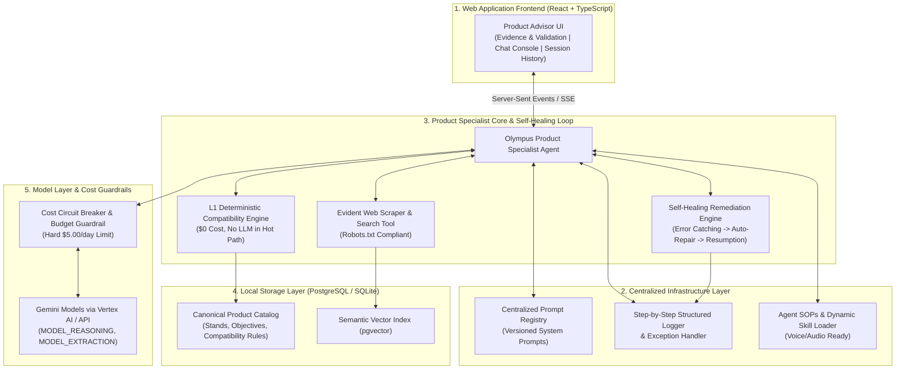
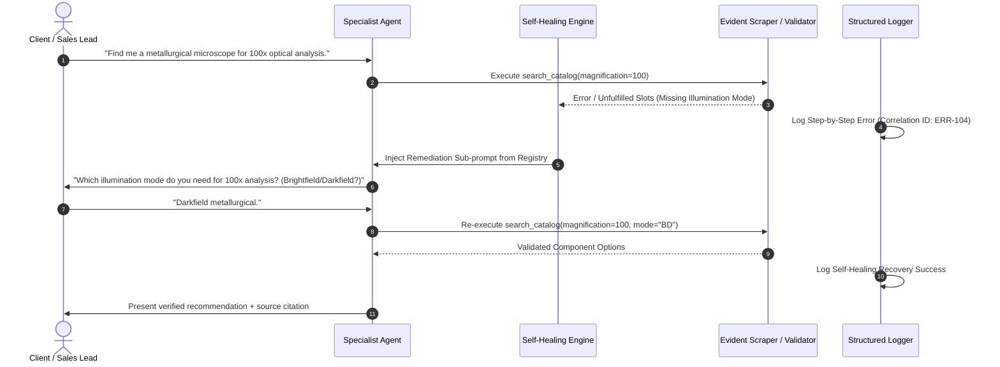

# Master Implementation Plan: Olympus Product Specialist Web Platform

> **Project:** Olympus Product Specialist Web Application  
> **Platform DNA:** DeNovo Synthesis Architecture  
> **Stack:** React + Vite + TypeScript (Frontend Web App) + FastAPI/SSE (Python Backend) + Antigravity SDK / ADK + PostgreSQL/SQLite + pgvector  
> **Status:** APPROVED FOR IMPLEMENTATION — $0 Local MVP Baseline with GCP Cost Guardrails  

---

## 1. System Architecture & Self-Healing Dataflow

The architecture features a **Self-Healing Loop** and **Centralized Management Infrastructure** alongside the 3-Layer DeNovo Engine.



---

## 2. Self-Healing Loop Sequence Diagram

When a tool call fails or returns malformed/incomplete data, the **Self-Healing Loop** intercepts the exception, fetches a remediation sub-prompt from the Centralized Prompt Registry, corrects the input parameters, and resumes execution seamlessly.



---

## 3. Directory & Module Layout

The codebase organizes prompts, logging, SOPs, and domain logic into centralized modules:

```
denovo-olympus-platform/
├── apps/
│   └── web/                         # React + Vite + TypeScript Web Application
│       ├── src/
│       │   ├── features/
│       │   │   ├── advisor/         # Product Advisor (P-Site)
│       │   │   ├── evidence/        # Evidence & Validation Panel (A-Site)
│       │   │   └── sessions/        # Session History (E-Site)
│       │   ├── components/
│       │   └── api/
│       ├── package.json
│       └── tsconfig.json
├── src/
│   └── olympus_specialist/          # Backend Python Core
│       ├── api/                     # FastAPI SSE endpoints
│       ├── prompts/                 # Centralized Prompt Registry (Versioned System Prompts)
│       ├── logging/                 # Step-by-Step Structured Logger & Exception Hierarchy
│       ├── sops/                    # Agent Standard Operating Procedures & Audio/Voice Hooks
│       ├── skills/                  # Dynamic Skill Loader (SOP-bound tools)
│       ├── self_healing/            # Autonomous Remediation Engine & Error Diagnostic Gate
│       ├── agents/                  # Specialist Agent Orchestrator
│       ├── domain/                  # Domain Business Logic (products, compatibility)
│       └── guardrails/              # Cost Circuit Breaker & GCP Daily Budget Limit ($5.00/day)
├── evals/                           # Evaluation & QA Suite
├── pyproject.toml                   # Managed via uv / .venv (managing-python-dependencies)
└── README.md
```

---

## 4. Cost Guardrails & GCP Model Garden Safety

To prevent unexpected GCP billing spikes (e.g., Model Garden / Vertex AI background charges):

1. **Hard Budget Circuit Breaker (`src/olympus_specialist/guardrails/cost_gate.py`):**
   * Tracks daily API spend.
   * Hard-blocks any model invocation if daily spend reaches **$5.00/day**.
2. **Explicit Idle Shutdown:**
   * Ensures no background model polling or unmonitored streaming loops remain active when the application is idle.

---

## 5. Open Questions & Review

> [!IMPORTANT]
> 1. **Centralized Prompt Registry Format:** Prompts will be stored as versioned YAML/Markdown templates in `src/olympus_specialist/prompts/`. Do you approve this format?
> 2. **Step-by-Step Logging:** Logs will be recorded in JSONL format with step-by-step correlation IDs (`session_id`, `step_index`, `action`, `status`, `healing_attempts`). Is this acceptable?
