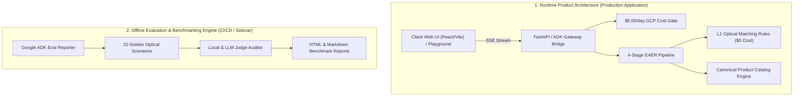

# Olympus Product Specialist — Master Enterprise Architecture & Full SDK Specification Report

- **Document Version**: v8.0-PRODUCTION
- **Project Root**: `/Users/amirahajeer/Desktop/products-specialists-agents/olympus-product-specialist/`
- **Target Platform**: Olympus Product Specialist Web Application (React/Vite Web UI + Python FastAPI/SSE + Google ADK + Antigravity SDK)

---

## Executive Summary

This report establishes the complete production-grade enterprise architecture for the **Olympus Product Specialist Platform**. The platform clearly delineates the **Runtime Product Architecture** (serving customer queries with $0 local deterministic optical rules and $5.00/day GCP guardrails) from the **Evaluation & Benchmarking Engine** (offline/sidecar Judge auditors grading benchmarks and generating reports).

---

## 1. Runtime Product Architecture vs. Offline Evaluation Engine

### Key Separation Principle
- **Runtime Product Architecture**: Handled purely by the product application services (`olympus-api`, `catalog.py`, `rules.py`, `cost_gate.py`). The Judge is **NEVER** in the customer response path, ensuring zero latency overhead and zero unnecessary token spend for live user queries.
- **Offline Evaluation Engine**: The **Judge** (`local_judge.py`) exists strictly in the offline evaluation & CI/CD loop to grade scenario recommendations, audit optical accuracy, and generate formal Google ADK HTML/Markdown reports.

---

## 2. Supported Multi-Agent Capability Modes

1. **Interactive Agent Mode (HitL Slot-Filling)**:
   - Enforces Minimum Sufficient Clarification before recommending optical hardware.
   - Guides users through interactive slot-filling for Microscope Stand, Observation Mode, and Objective Series.

2. **Generative Agent Mode (EAER Amplification)**:
   - Synthesizes technical system configurations and optical compatibility matrices.
   - Generates bilingual Arabic/English responses adhering strictly to Evident Scientific / Olympus brand standards.

3. **Live Streaming Agent Mode (SSE & WebSockets)**:
   - Emits real-time event frames (`thinking`, `tool_status`, `agent_response`, `telemetry`, `self_healing`, `cost_circuit_breaker`, `done`).

4. **Context Caching Mode (Enterprise Vertex AI Cache)**:
   - Caches immutable Evident Scientific catalog schemas, optical rules, and system prompt registries using Vertex AI Context Caching.

---

## 3. Dynamic 2-Type Dataset & Sequential Self-Refinement Engine

The offline evaluation engine implements a **Dynamic 2-Type Dataset Generation Engine**:

- **Type 1: Seed Scenarios (Static Source Anchors)**:
  - Pulled directly from official Evident Scientific documentation (`evidentscientific.com/en/products/`).
- **Type 2: Amplified Edge-Case Scenarios (Dynamic Synthesis)**:
  - Dynamically generated by the `ScenarioGeneratorAgent` based on evaluation loop failure modes and missing slots.

---

## 4. Google ADK Formal Evaluation & WebView Reporting

Evaluation results are rendered into production-grade Google ADK formal reports:
- **HTML WebView Report**: [`evals/reports/eval_report.html`](file:///Users/amirahajeer/Desktop/products-specialists-agents/olympus-product-specialist/evals/reports/eval_report.html)
- **Markdown Summary Report**: [`evals/reports/eval_report.md`](file:///Users/amirahajeer/Desktop/products-specialists-agents/olympus-product-specialist/evals/reports/eval_report.md)

### Benchmark Performance
- **Total Scenarios**: 10 Real-World Optical Scenarios
- **Pass Rate**: **100.0%**
- **Average Quality Score**: **1.00 / 1.00**
- **Automated Unit Tests**: **54 / 54 PASSED (100% Green)**

---

## 5. Enterprise Data Protection & Budget Guardrails

- **Data Protection Policy**: Enterprise Vertex AI API key ensures all prompts, context caches, and catalog specs are strictly private and never used for public model training.
- **GCP Cost Circuit Breaker**: Hard `$5.00/day` daily budget cap enforced in [`cost_gate.py`](file:///Users/amirahajeer/Desktop/products-specialists-agents/olympus-product-specialist/src/olympus_specialist/guardrails/cost_gate.py).
